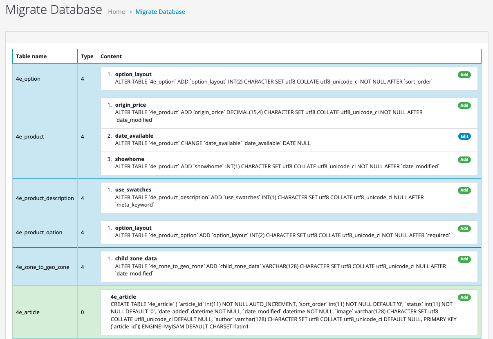

# opencart database compare

**OC database compare** is a tool to help admins and developers check **Opencart's** database schema changes during website development. This schema change can be caused by the developers themselves or by the extensions they install.

> * PHP : 8+
> * Opencart : 4.x.x

## User manual

### Install

`-` clone the whole source from git to your machine

`-` copy and **merge** the **admin** folder with your admin folder

### Using

`-` Access the following route : 

**https://your_admin_url/index.php?route=tool/migrate**

You will see the database schema changes statistics interface

# License

`-` **OC database compare** is released under the MIT license. [See LICENSE](LICENSE) for details.

`-` **OC database compare** is useful for you? Please consider donating to sustain our activities ? Please consider [donating](https://www.paypal.me/lequang1988) to sustain my activities.

